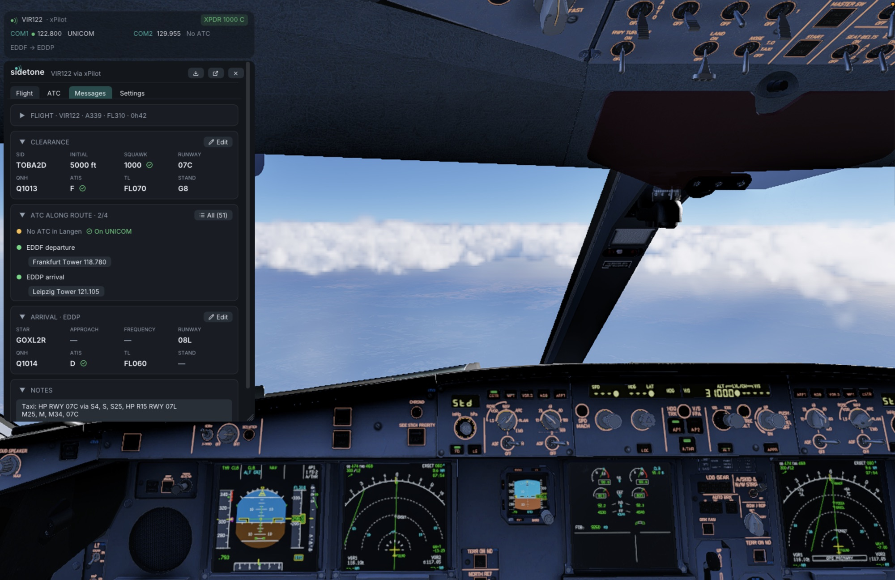
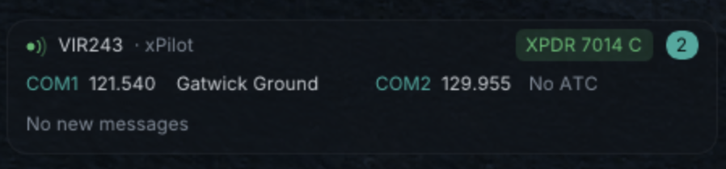
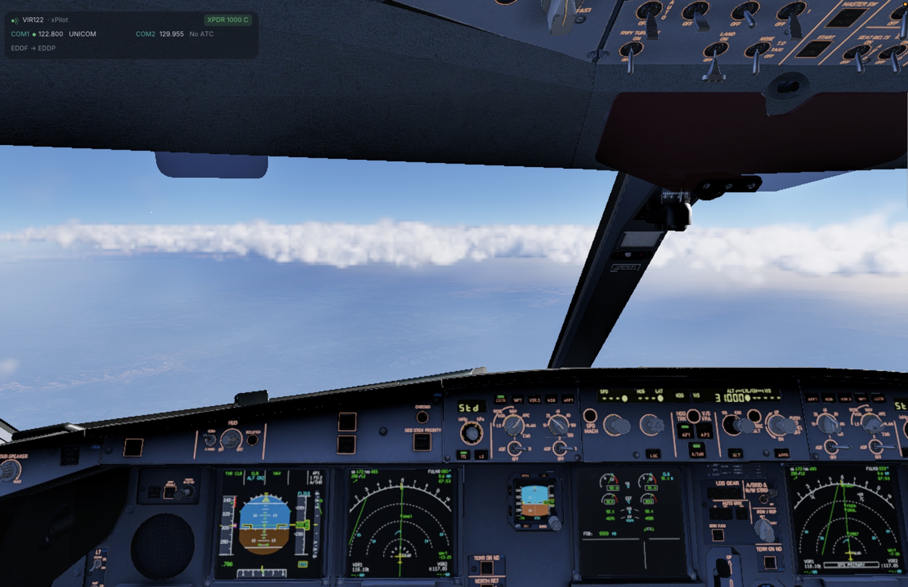
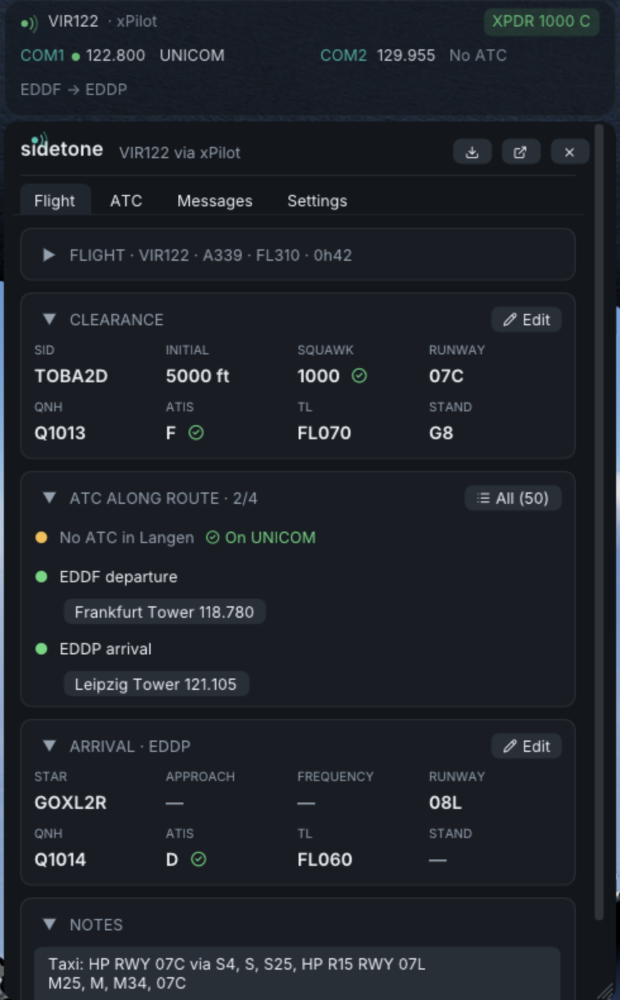
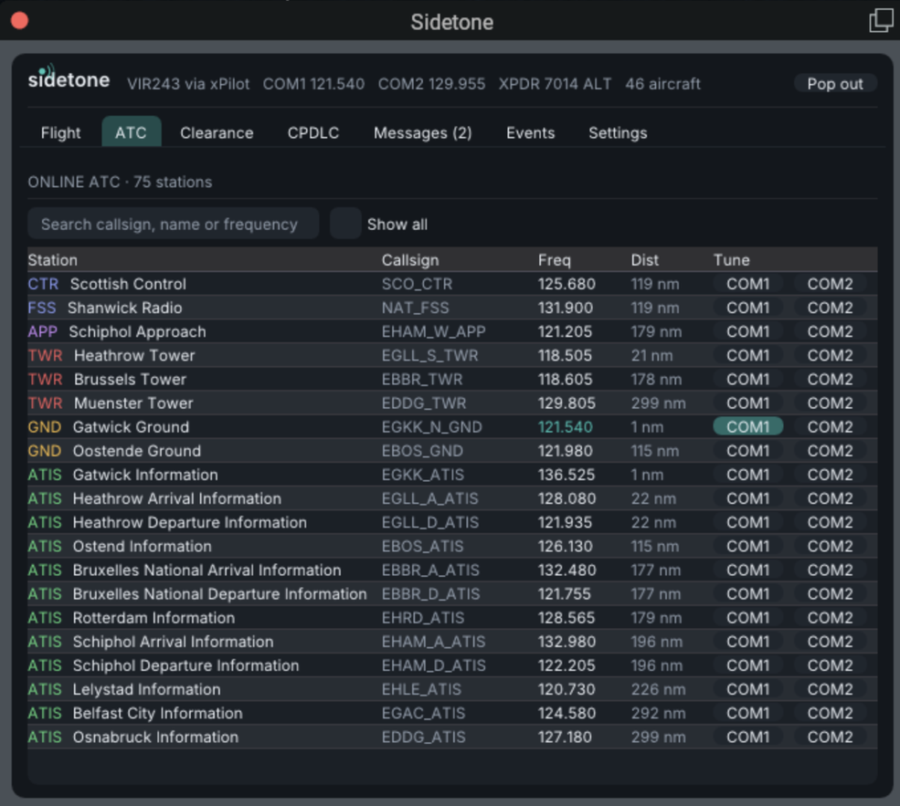

<h1 align="center">Sidetone</h1>

<p align="center">
  <strong>A native VATSIM pilot client that lives inside X-Plane 12.</strong><br>
  Know who to call, who's on your route and what you were told, without leaving the cockpit.
</p>

<p align="center">
  <a href="https://github.com/sidetonehq/sidetone/actions/workflows/ci.yml"></a>
  <a href="LICENSE"></a>
  
  
</p>

<p align="center">
  
</p>

> **Status: pre-release.** Everything built on VATSIM's *public* data works today, alongside
> your current pilot client (with an optional xPilot companion mode). Connecting to the network
> as a pilot (FSD + voice) needs VATSIM's approval of Sidetone as a client; until then that part
> is developed against a private test server only. See [Sidetone and VATSIM](docs/VATSIM.md)
> and the [roadmap](docs/ROADMAP.md).

## Why Sidetone

- **Lives in the sim.** No second app, no alt-tabbing. A small panel sits in the corner and the
  full window is one click away: docked, popped out, in VR, or attached under the panel as a
  narrow sidebar. Every screen adapts to a narrow window.
- **Talks like ATC.** Frequencies become spoken station names ("Gatwick Ground", "Schiphol
  Approach"), so you know who you'll hear before you tune.
- **Knows your flight.** Import SimBrief and Sidetone follows your airports and route: ATIS,
  METARs, who's staffed along the way, and who to call for your clearance.
- **Costs you no frames.** All network work runs on background threads; the UI redraws from a
  cache when you're not touching it. Settings shows the measured cost per frame.

## A tour

### The panel

<p align="center">
  
</p>

Your callsign and connection, both radios with the station you'd actually hear (8.33 kHz aware,
nearest transmitter wins, "No ATC in range" when it's too far), a transponder check against your
assigned squawk, and a message ticker that also tells you who to call next. The mark lights red
while you transmit. Translucent until you hover it; drag it anywhere.

<p align="center">
  
</p>

### Flight: the whole flight on one page



**Import flight** (top right, on every tab) pulls in your latest SimBrief plan and starts a new
flight. Everything else follows from it, in cards you can fold away:

- **Get set up**: on first run, a checklist (CID, push-to-talk test, SimBrief, xPilot)
  that ticks itself off as you go.
- **Who to call** right now, with the frequency one click away.
- **Flight**: departure and arrival at a glance (ATIS letter, with the full ATIS and
  METAR on hover, click to keep them open, and event badges), then the full route as filed on
  VATSIM (with the SID and STAR from SimBrief when the filing leaves them out), its source and
  alternate on hover, and a warning if it differs from SimBrief.
- **Clearance**: until you're cleared, who to call, one click from your radio. Then your
  clearance as tiles in the order ATC reads it (SID, initial level, squawk, then runway, QNH,
  ATIS, transition level and stand), each always in the same place. The squawk gets a green
  tick once your transponder matches and the ATIS letter one while it's current; otherwise the
  value turns amber with a warning. **Enter clearance** opens a popup with your route alongside
  the fields, so the SID is in view as you note it. Folds itself away at takeoff.
- **ATC along route**: who's staffed along the way, with one-click tuning, and a count of how
  many areas are. When nobody covers where you are, "Switch to UNICOM".
- **Arrival**: STAR, approach and the frequency you're told to call (one click from your
  radio), then runway, QNH, ATIS and transition level in the same places as on the clearance.
  The ATIS letter, QNH and transition level are kept current. Opens itself at takeoff as the
  clearance folds away.
- **Notes** for the taxi route and anything else, kept until you import your next flight.

<br clear="right">

### ATC: everyone online



Every controller within 300 nm (or the whole network), grouped by type and nearest first.
Search by callsign, name or frequency, hover a station for its controller info and where its
spoken name came from, and tune COM1 or COM2 in one click. Hundreds of stations scroll as
smoothly as a screenful.

<br clear="right">

### And

- **Clearance fields fill themselves**: runway and SID from SimBrief, your assigned squawk from
  VATSIM, the ATIS letter and transition level from the ATIS, and QNH from the METAR, kept
  current as they change. Anything you type wins.
- **Messages**: a message log with dot commands that work today (`.com1 122.8`, `.x 7000`,
  `.metar EGLL`, `.clear`).
- **CPDLC and PDC** stay with your aircraft: many study-level aircraft connect to Hoppie ACARS
  themselves.
- **SimBrief import** that starts a new flight, **VATSIM events** at your airports, and your
  pilot and ATC hours.
- Your **VATSIM CID is found automatically** from your live callsign or SimBrief plan.
- **xPilot companion mode** (optional): until Sidetone connects natively, show xPilot's
  connection in the panel, light up receive indicators, surface SELCAL calls and share one
  push-to-talk key.
  Read-only towards the network.
- **Settings** for UI scale, panel opacity, ATIS and METAR change notices, and push-to-talk on
  X-Plane's own "Contact ATC" key or a dedicated bindable command.
- **Keyboard-friendly**: Sidetone only holds the keyboard while you type in a field (Cmd+C/V/X/A/Z
  supported) and hands it back on Enter, Escape or when you move away, keeping what you typed.

## Install

1. Download the latest zip from [Releases](https://github.com/sidetonehq/sidetone/releases).
2. Unzip it and copy the `Sidetone` folder into `X-Plane 12/Resources/plugins/`.
3. Start X-Plane and click the panel to get started.

Builds are not yet notarized, so macOS may ask you to allow the plugin the first time (System
Settings → Privacy & Security → Allow Anyway). SimBrief is optional; your Pilot ID is stored in
your macOS Keychain.

> **Coming soon:** Windows support for X-Plane 12, and a version for Microsoft Flight
> Simulator. Sidetone's core, VATSIM data and services code is already simulator- and
> platform-independent, so both build on the same foundation.

## Build from source

Requires Rust (stable) and Xcode command-line tools. For a universal (Apple Silicon + Intel)
build, use rustup and `rustup target add aarch64-apple-darwin x86_64-apple-darwin`.

```sh
cargo test --workspace          # unit tests
cargo xtask bundle              # dist/Sidetone/mac_x64/Sidetone.xpl
cargo xtask install             # bundle + copy into ~/X-Plane 12 (or --xplane <path>)
```

Releases are built by CI: pushing a tag like `v0.1.0` publishes a universal zip. See
[Releasing](docs/RELEASING.md).

Logs: `X-Plane 12/Output/Sidetone/Sidetone.log`. Settings: `Output/preferences/Sidetone.toml`.
Secrets (your SimBrief Pilot ID) live in the macOS Keychain.

## Layout

| Crate | Purpose |
|---|---|
| `sidetone-xplm-sys` / `sidetone-xplm` | X-Plane SDK 4.3 bindings and safe wrappers |
| `sidetone-ui` | Dear ImGui hosted in X-Plane windows (legacy-GL renderer, input, theme) |
| `sidetone-core` | State, settings, alerts, clearance parsing — no X-Plane dependency |
| `sidetone-vatsim` | VATSIM data feed, station naming, coverage, events |
| `sidetone-services` | SimBrief, Keychain |
| `sidetone-plugin` | The plugin: wiring and screens |

## Documentation

- [Architecture](docs/ARCHITECTURE.md): crates, threads, rendering, safety rules
- [Sidetone and VATSIM](docs/VATSIM.md): exactly what is fetched, how often, and what is never done
- [Roadmap](docs/ROADMAP.md) · [Changelog](CHANGELOG.md) · [Contributing](CONTRIBUTING.md) · [Security](SECURITY.md)

## Licences and credits

Sidetone is Apache-2.0. Station names and sectors use the
[VATSpy data project](https://github.com/vatsimnetwork/vatspy-data-project) (CC BY-SA 4.0), and
approach and departure airspace the
[SimAware TRACON Project](https://github.com/vatsimnetwork/simaware-tracon-project)
(CC BY-SA 4.0), both downloaded at runtime. Which controller owns the airspace at your level
comes from the [VATGlasses data project](https://github.com/lennycolton/vatglasses-data)
(CC BY-NC-SA 4.0), downloaded at runtime for the areas you fly through and never bundled.
The Inter font is SIL OFL 1.1 and the Lucide icons are ISC. The X-Plane SDK is © Laminar Research
under its own permissive licence.
